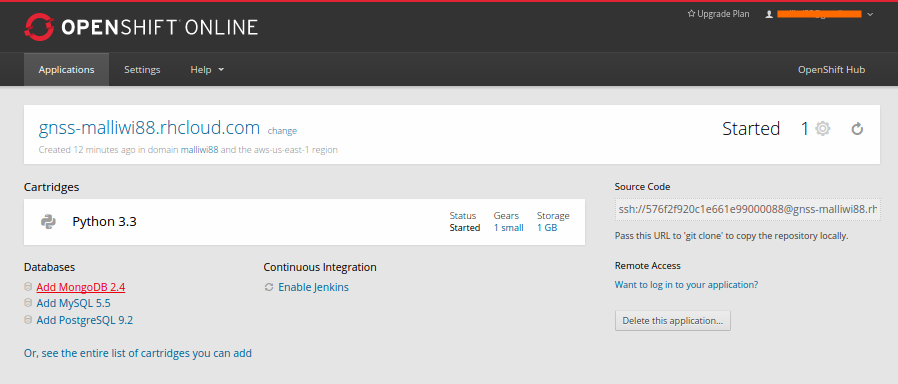
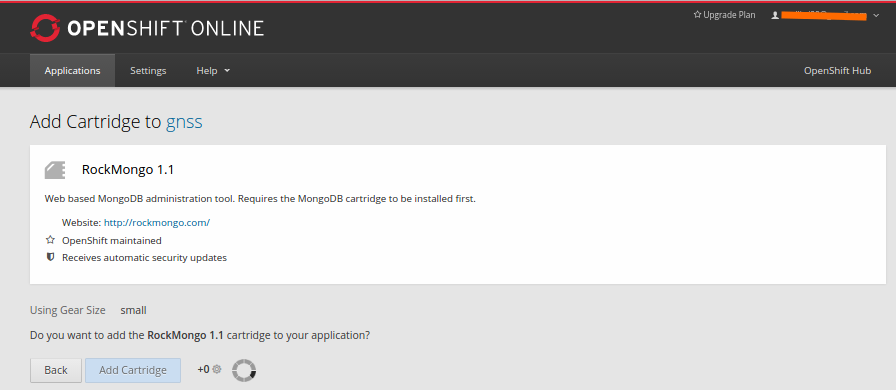
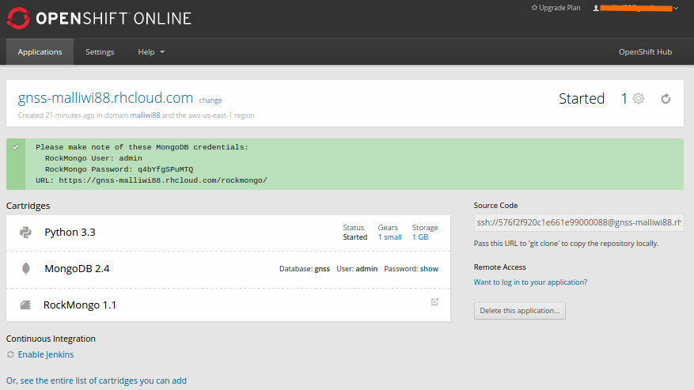
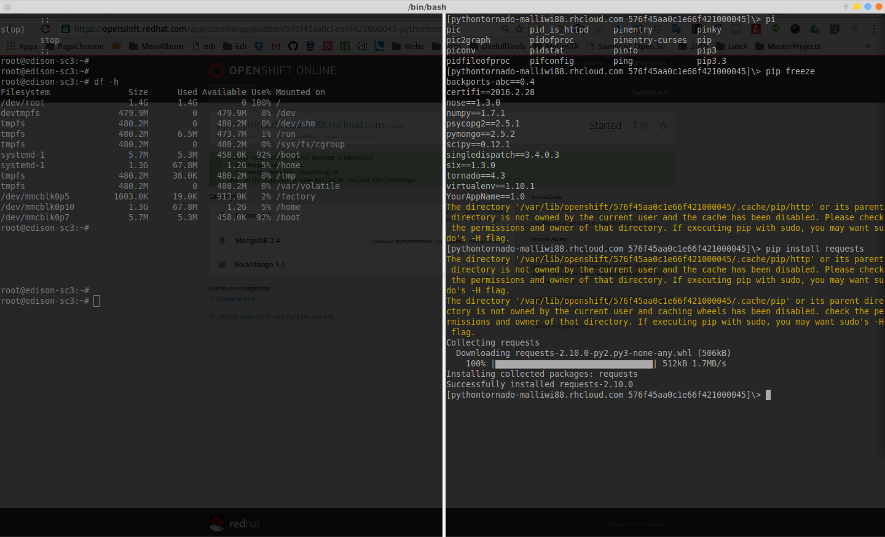

# Python 3.3 + Tornado en Openshift

Accediendo al boton deploy de la siguiente pagina

Esto nos llevara a nuestra cuenta de Openshift

Clickamos para **crear Aplicación**

## Agregando MongoDB 2.4
Desde el link que dice **Continue to the application overview page.**

De la siguiente imagen nos aparecen mas aplicaciones sugeridas para acompañar a **python 3,3**, de las cuales necesitamos **Add MongoDB 2.4**

como podemos ver se ha agregado satisfactoriamente Python y Mongo

## Agregando RockMongo 1.1

Ahora de las aplicaciones sugeridas, elegimos **Add RockMongo 1.1**

Finalmente todas las aplicaciones que necesitamos para nuestra prueba estan disponibles.

## Como verifcar o Instalar modulos de python en Openshift
http://stackoverflow.com/questions/24572276/install-python-packages-on-openshift

Para la ejecución de nuestras aplicaciones necesitamos intalar uno modulos adicionales a nuestro python

> python -V 	(**Verificar version de python**)
> pip -V       	(**Verificar version de pip**)
> pip freeze  	(**Saber que modulos tiene instalados python**)
pip install requests serial

# Logueandonos con SSH en nuestro servidor

Como se puede ver para este caso, en la parte inferior derecha aparece una caja que nos indica la dirección con la cual podemos acceder al servidor, a traves de ssh

## clonando nuestra App Openchift

git clone ssh://576f45aa0c1e66f421000045@pythontornado-malliwi88.rhcloud.com/~/git/pythontornado.git/

basado en:
- https://hub.openshift.com/quickstarts/85-tornado-web-server
- https://github.com/rancavil/tornado-openshift-quickstart
- https://developers.openshift.com/managing-your-applications/modifying-applications.html
- https://github.com/opensas/play-demo/wiki/Step-12.5---deploy-to-openshift