# creación de la cuenta

- acceder a https://openshift.redhat.com
- llenar lso campos
- recibir el correo de confirmación
- aceptar los terminos de serivicio

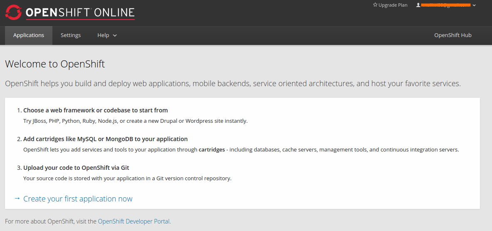

seguimos el link **Create your first application now**

## Configurando el servidor o contenedor que correra la aplicación

En la figura anterior aparecen una variadad de contenedores que ya tienen aplicaciones predeterminadas para ciertos propositos (paginas webs, servidores Tomcat, etc).

En el caso de lo que queremos es correr un servidor con Python 3.3
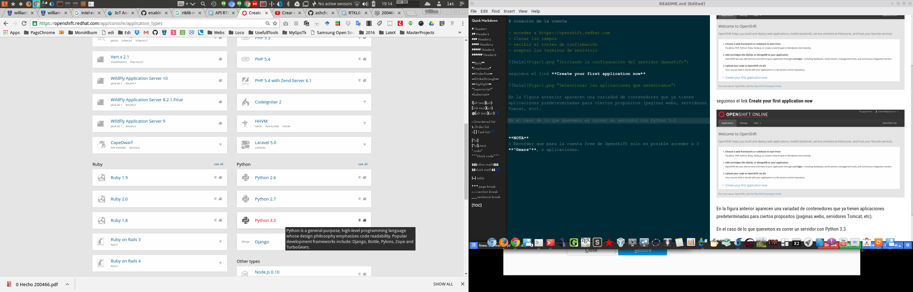

**NOTA**
> Recordar que para la cuenta free de Openshift solo es posible acceder a 3 **"Gears"**, o aplicaciones.

## creando la aplicación

Aquí, la idea es tener un dominio que identifica a la aplicación que corre y el dominio(pag web) que la contiene.

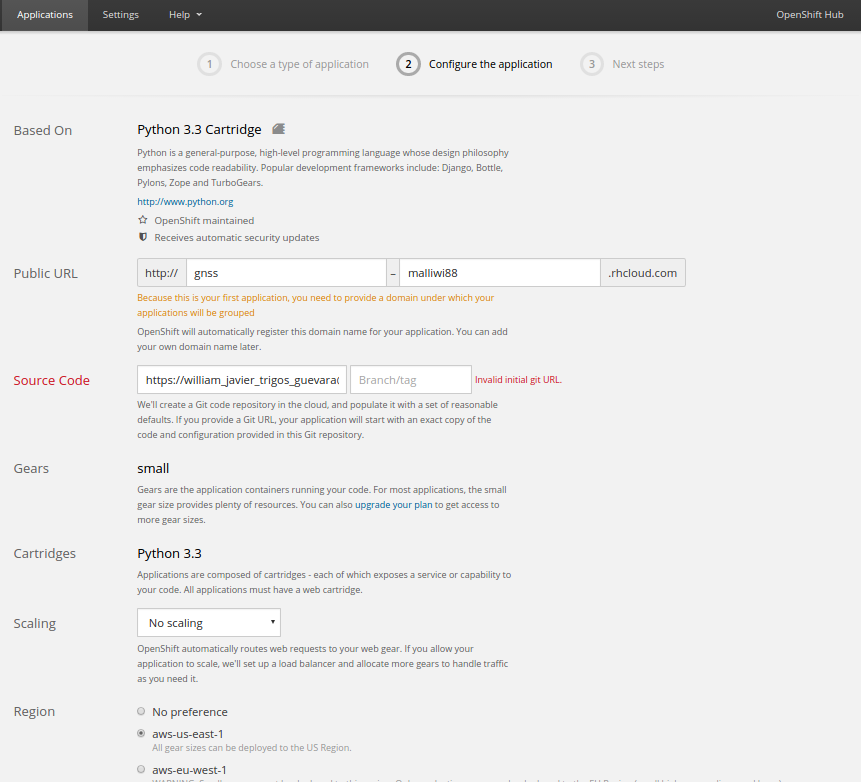

Opcionalmente puede agregar un repositorio git que contenga código fuente de su aplicación. **Si Ud decide agregar un repositorio con código fuente, asegurese que este este público o en su defecto este alojado en Github**. 
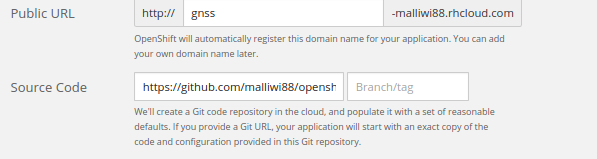

Para que Openshit pueda acceder y actualizar codido desde el repositorio es necesario proveer su clave ssh.

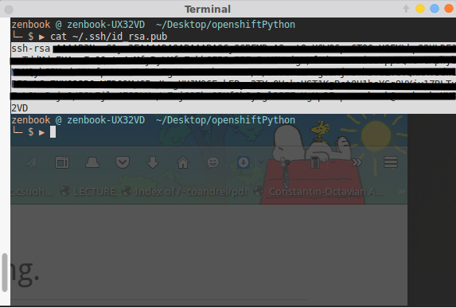

y proveerla durante la creación del servidor de aplicación Opershift
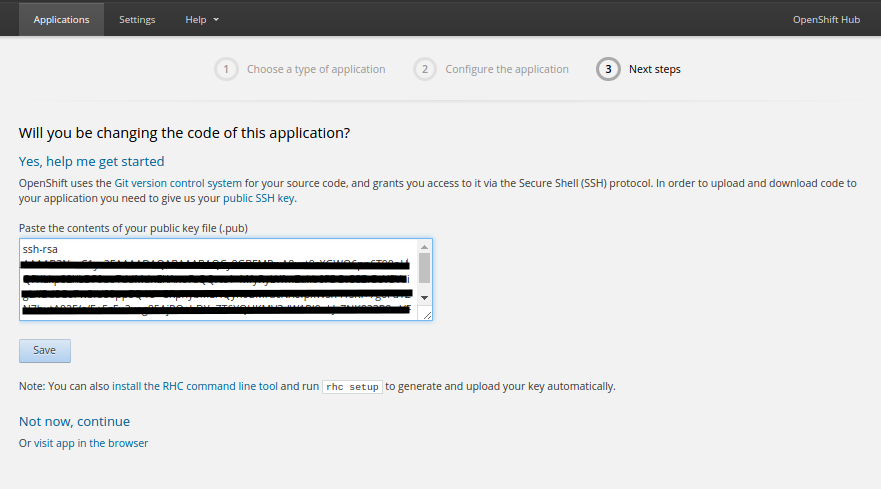

Con esto hemos termimnado de crear la aplicación para probar python 3.3
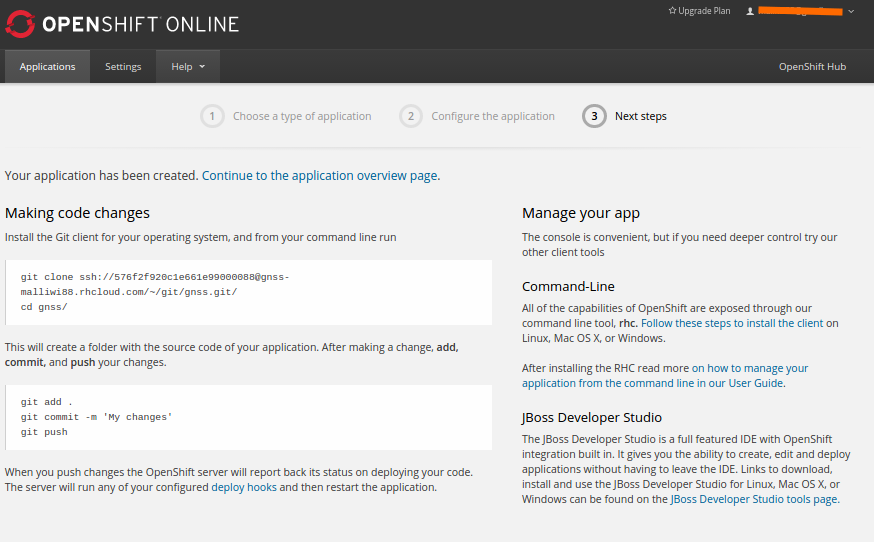

# Ir a la aplicación

`## Agregando MongoDB 2.4
Desde el link que dice **Continue to the application overview page.**
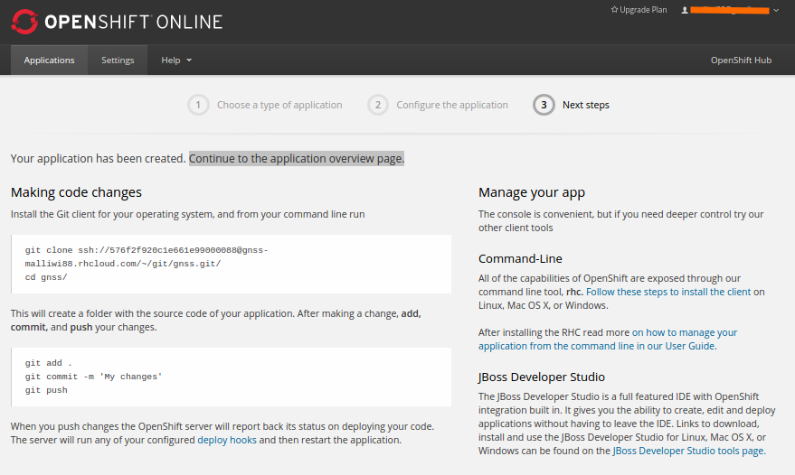

De la siguiente imagen nos aparecen mas aplicaciones sugeridas para acompañar a **python 3,3**, de las cuales necesitamos **Add MongoDB 2.4**
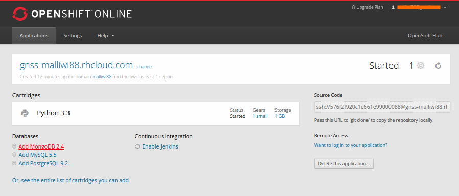
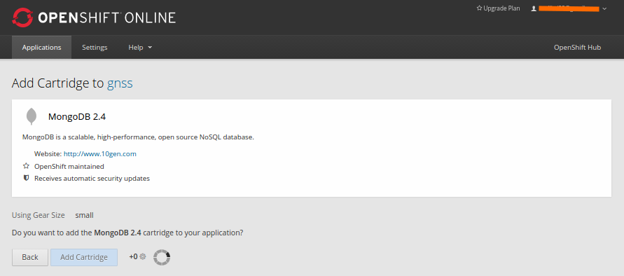

como podemos ver se ha agregado satisfactoriamente Python y Mongo

## Agregando RockMongo 1.1

Ahora de las aplicaciones sugeridas, elegimos **Add RockMongo 1.1**
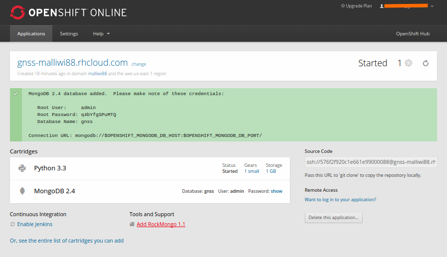
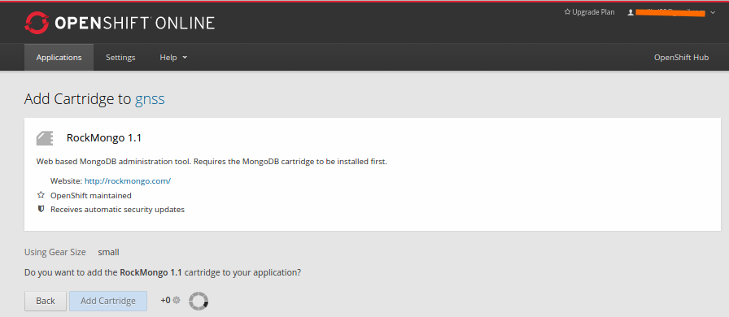

Finalmente todas las aplicaciones que necesitamos para nuestra prueba estan disponibles.

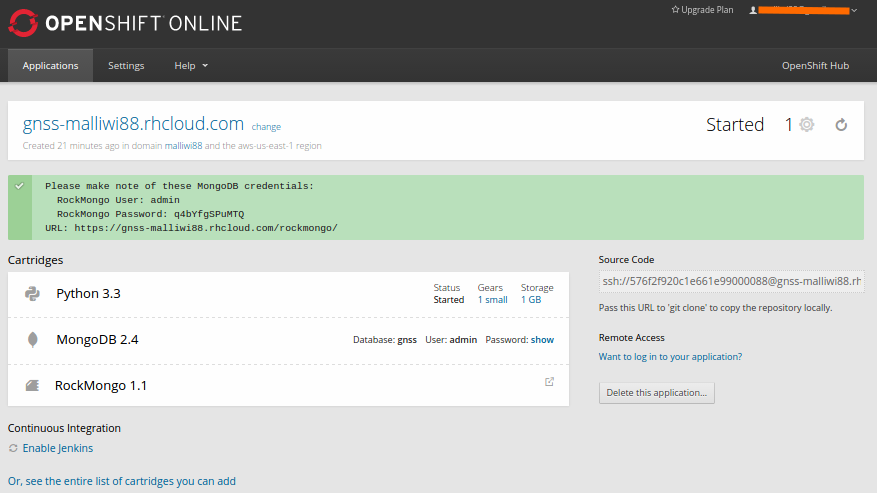

# Logueandonos con SSH en nuestro servidor

Como se puede ver para este caso, en la parte inferior derecha aparece una caja que nos indica la dirección con la cual podemos acceder al servidor, a traves de ssh`

**`ssh 576f45aa0c1e66f421000045@pythontornado-malliwi88.rhcloud.com`**

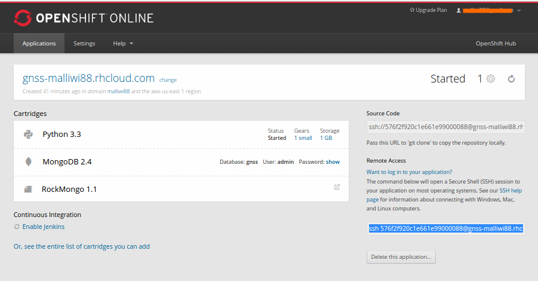

los archivos de nuestro repositorio estan en la ruta

**`cd app-root/repo`**

## Como verifcar o Instalar modulos de python en Openshift
http://stackoverflow.com/questions/24572276/install-python-packages-on-openshift

Para la ejecución de nuestras aplicaciones necesitamos intalar uno modulos adicionales a nuestro python

> python -V 	(**Verificar version de python**)
> pip -V       	(**Verificar version de pip**)
> pip freeze  	(**Saber que modulos tiene instalados python**)
pip install requests

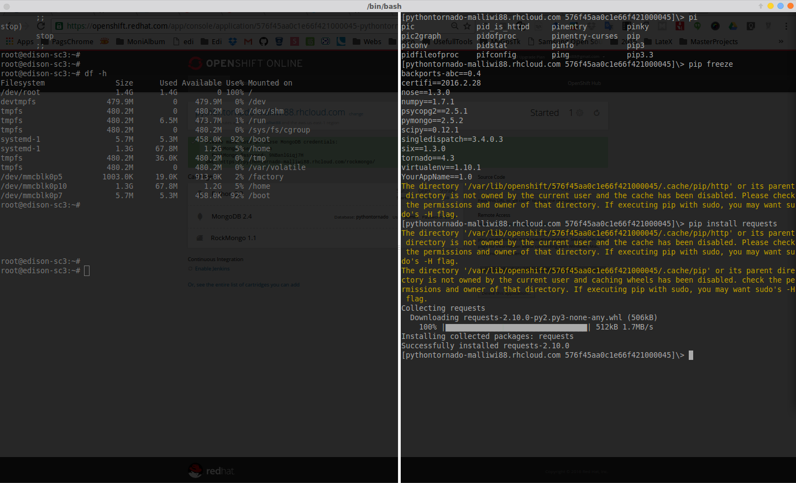
